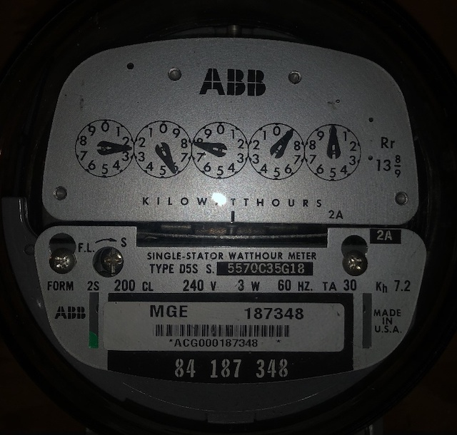
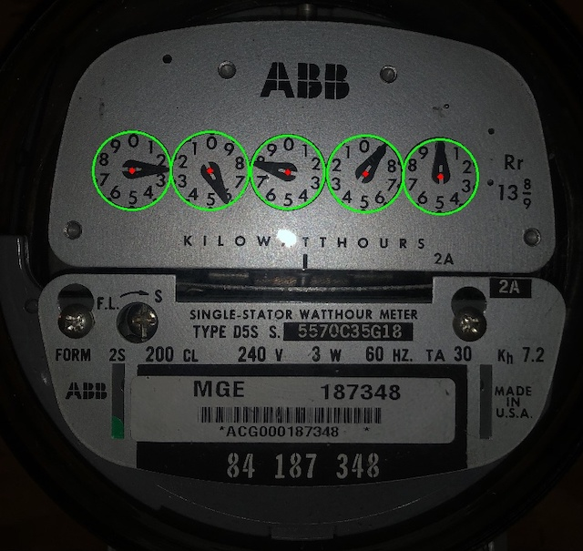
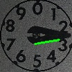
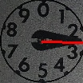
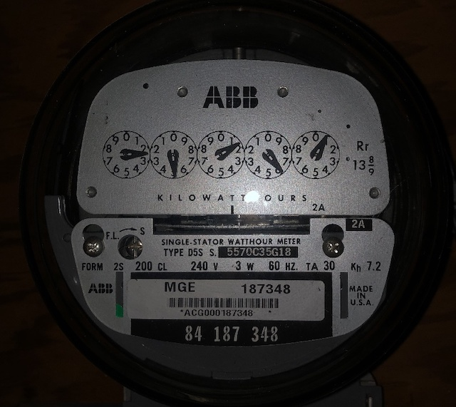

# Power Meter Reader

I wanted to record how much power our house is using in near real time so we can correlate with whatever activity we're doing at the time. There are [fancy devices](https://sense.com) you can get to do this in smart ways, however, they're expensive and it occurred to me that I already have a thing on my wall telling me exactly how much power I'm using.



With a small amount of dodgy python and a few bits of [OpenCV](https://opencv.org), it's possible to automate reading these (I've not written any python in years...).

Is heavily inspired an [Intel Gauge Reading Example](https://github.com/intel-iot-devkit/python-cv-samples/tree/master/examples/analog-gauge-reader).


## How it works

First we pick out the dials from the image:



For each dial we do a little edge detection:


Find the most prominent edge that is very likely one side of the dial hands.



Then work out the point where this line intersects with the edge of the dial and use the angle between this and the center of the dial to determine its value.




## Example




```
> python3 power-meter-reader.py examples/2.jpg
25160
```
